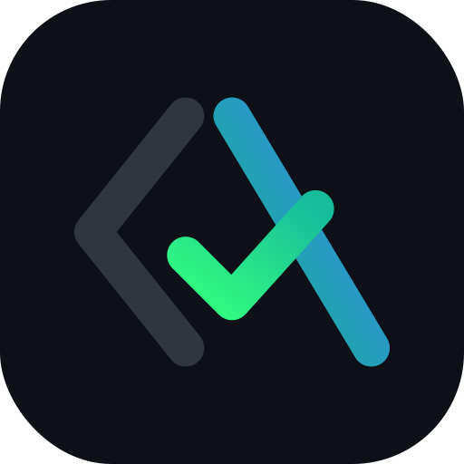
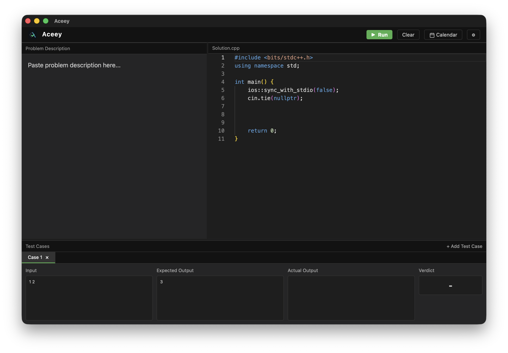
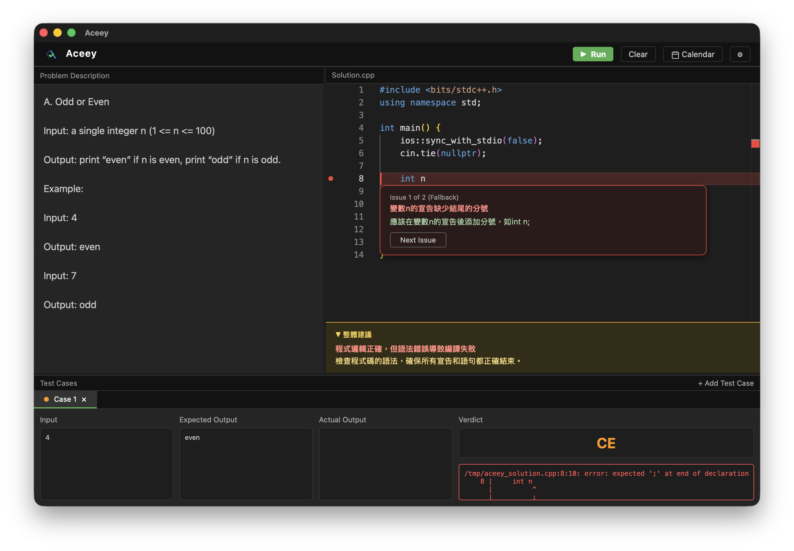
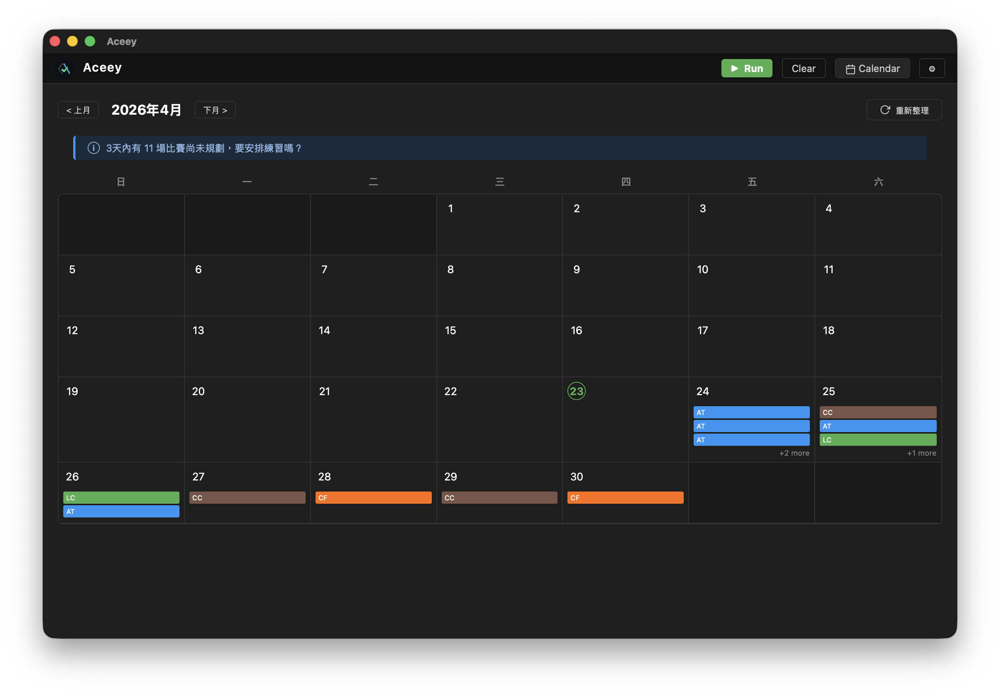
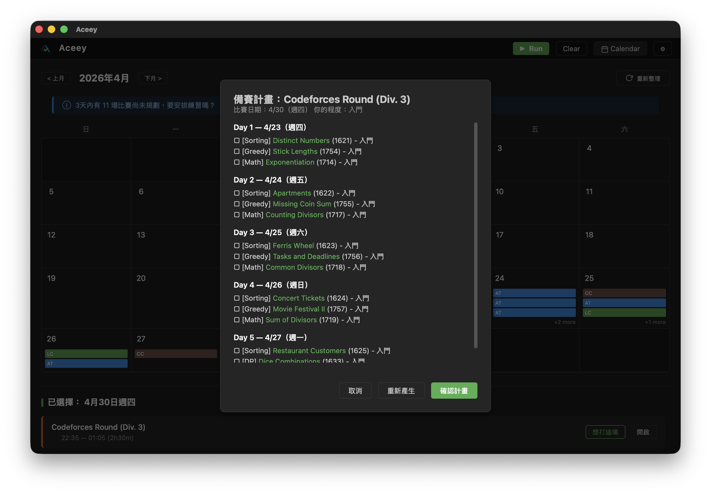
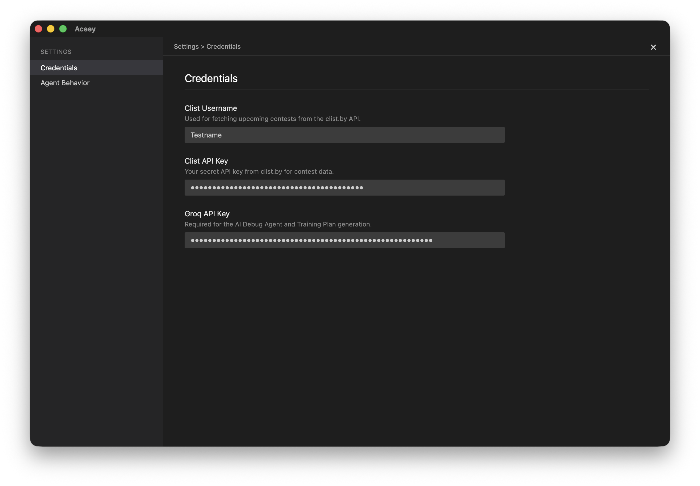
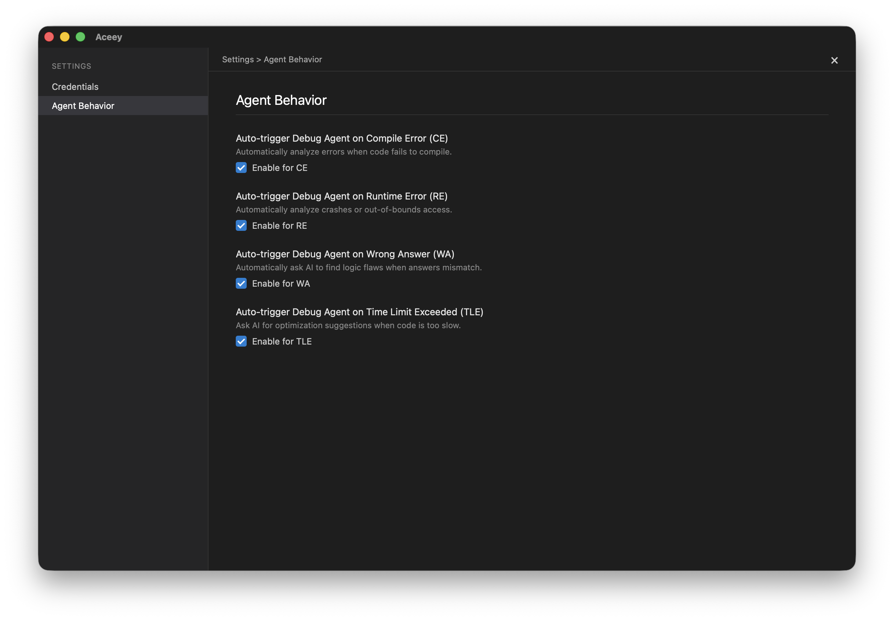

<p align="center">
  
</p>

<h1 align="center">Aceey</h1>

<p align="center">
  An AI-native IDE built strictly for competitive programming.
</p>

<p align="center">
  
  
  
  
  
</p>

---

<p align="center">
  Aceey combines a LeetCode-style coding interface with an AI agent that plans your contest preparation. Paste a problem, write your solution, compile and test — all in one window. When a contest approaches, the AI generates a personalized multi-day training plan using real CSES problems.
</p>

## Overview

Aceey is a desktop integrated development environment built specifically for competitive programming. It combines a LeetCode-style interface with AI-powered training planning and contest management. The application is built using Tauri v2 and integrates the Monaco Editor for a high-performance coding experience.

## Features

### IDE & Immersive Debugging
- **LeetCode-style split-pane layout**: Problem panel, high-performance code editor, and interactive test cases all in one view.
- **Monaco Editor Integration**: Full C++ syntax highlighting, autocomplete, and native editor experience.
- **AI Debug Agent**: Advanced error analysis using the Socratic method. Instead of giving solutions, the agent uses Monaco Decorations and Zone Widgets to highlight problematic lines and provide hints that guide you toward the fix.
- **Integrated C++ Engine**: High-speed compilation and execution (g++, C++17) with support for Multiple Test Cases and automated verdict comparison (AC/WA/CE/RE/TLE).

### Contest Calendar & AI Training
- **Global Contest Tracking**: Clist.by API integration covering Codeforces, AtCoder, LeetCode, CodeChef, and more.
- **Personalized Training Plans**: Select an upcoming contest to receive a customized multi-day practice schedule using curated problems from the CSES Problem Set.
- **Smart Notifications**: Passive alerts for upcoming contests ensure you never miss an opportunity to compete.

### User Preferences & Security
- **Tauri Store Persistence**: All configurations are stored securely on the local machine using `@tauri-apps/plugin-store`, removing the need for manual `.env` file management.
- **Granular Agent Controls**: Fully customizable AI behavior. Toggle the Debug Agent on or off for specific error types (CE/RE/WA/TLE) via the VS Code-style Settings panel.

## Screenshots

### Main IDE & Debug Agent
<p align="center">
  
</p>
<p align="center">
  
</p>

### Contest Calendar & Training Plan
<p align="center">
  
</p>
<p align="center">
  
</p>

### VS Code Style Settings
<p align="center">
  
  
</p>

## Tech Stack

| Component | Technology |
|-----------|-----------|
| Framework | Tauri v2 (Rust backend + Web frontend) |
| Code Editor | Monaco Editor |
| Persistence | @tauri-apps/plugin-store |
| AI Model | Groq - Llama 3.3 70B |
| Language Support | C++ (g++, C++17) |

## Getting Started

### Prerequisites

- Node.js (v18+)
- Rust toolchain (rustup)
- g++ compiler

### Installation

1. Clone the repository:
   ```bash
   git clone https://github.com/rayhuang2006/Aceey.git
   cd Aceey
   ```

2. Install dependencies:
   ```bash
   npm install
   ```

3. Launch the application:
   ```bash
   npm run tauri dev
   ```

4. **Initial Setup**: After the application launches for the first time, click the **⚙ (Settings)** button in the top right corner. Enter your **Clist Username**, **Clist API Key**, and **Groq API Key** in the settings panel. These will be saved securely to your local storage.

## Roadmap

- [x] IDE skeleton with Monaco Editor
- [x] C++ compile and run engine
- [x] Contest calendar (Clist.by API)
- [x] AI training plan generator
- [x] **Debug Agent**: AI-powered error analysis with Monaco Decorations and Zone Widgets
- [x] **Data Persistence**: Local storage via Tauri Store
- [x] **Settings Panel**: Centralized configuration for API keys and Agent behavior
- [ ] Guided Problem Solving Agent: Socratic-style step-by-step hints
- [ ] AtCoder problem auto-fetch
- [ ] Multi-language support (Python, Java)

## License

This project is licensed under the MIT License. See the [LICENSE](LICENSE) file for details.
